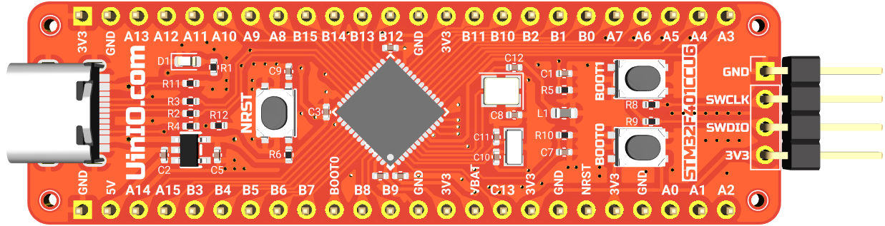

# UINIO-MCU-STM32F401CCU6 核心板

[**UINIO-MCU-STM32F401CCU6**](https://gitee.com/uinika/UINIO-MCU-STM32F401CCU6) 是一款基于 [**意法半导体**](https://www.st.com/zh/microcontrollers-microprocessors/stm32-32-bit-arm-cortex-mcus.html) **UFQFPN48** 封装的 **STM32F401CCU6** 微控制器的核心板电路设计，该微控制器基于 **ARM Cortex-M4** 内核架构，主频可以达到 `72MHz`，片上载有 `256KB` 容量的 Flash 存储器和 `64Kbytes` 的 SRAM 存储器，并且拥有 3 组 **USART** 和 **I²C** 接口，以及 4 组 **SPI** 接口与 `USB2.0` 全速控制器、12 位分辨率的 `ADC/DAC` 转换器，整体上属于高性价比、高性能主控芯片产品。

## 设计概要

1. 引出了意法半导体 **STM32F401CCU6** 型微控制器上面的全部 GPIO 引脚资源；
2. 单独提供有四线制的 **SWD** 下载接口，便于快速与 [UINIO-DAP-Link](http://uinio.com/Project/UINIO-DAP-Link) 建立连接；
3. 分别使用了 `8MHz` 与 `32.768KHz` 两枚贴片晶振作为系统外部时钟与实时时钟；
4. 板载 **BOOT0** 和 **BOOT1** 两枚启动配置按钮，以及一枚 **NRST** 复位按钮；
5. 模拟电源引脚 `VDDA` 使用了对 `100Mhz` 高频杂散信号存在 `1KΩ` 阻抗的**磁珠**进行单点接地；

## 启动配置

**UINIO-MCU-STM32F401CCU6** 通过板载的 `BOOT0` 和 `BOOT1` 两枚按钮来配置启动方式，默认情况下是从片上的 Flash 闪存进行启动，具体的配置信息可以参见下表：

| BOOT0 | BOOT1 | 启动方式                 |
| :---: | :---: | :----------------------- |
|  `0`  |  `X`  | 片上 Flash 闪存          |
|  `1`  |  `0`  | 系统存储器/ISP           |
|  `1`  |  `1`  | 片上 SRAM 静态随机存储器 |

## 参考技术文档

[UinIO.com 电子技术实验室](http://uinio.com/) 为 UINIO-MCU-STM32F401CCU6 开源项目提供了如下一系列技术参考资料：

1. [《基于 HAL 与 LL 的 UINIO-MCU-STM32F401 开发实践》](http://uinio.com/Embedded/STM32F401/)
2. [《ARM 调试工具 UINIO-DAP-Link 应用详解》](http://uinio.com/Project/UINIO-DAP-Link/)
3. [《BOM 交互式物料清单与 PCB 布线在线预览》](http://uinio.com/archives/BOM/UINIO-MCU-STM32F401CCU6.html)
